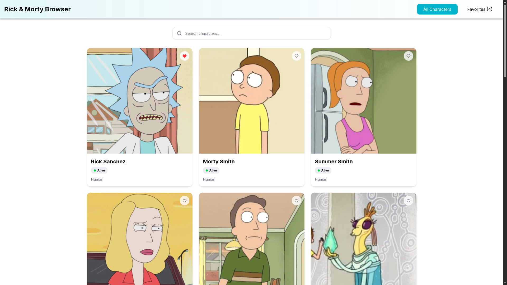
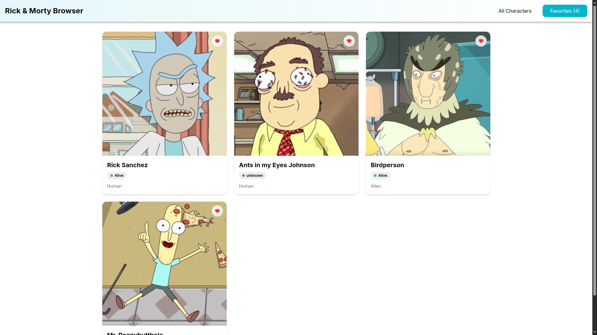
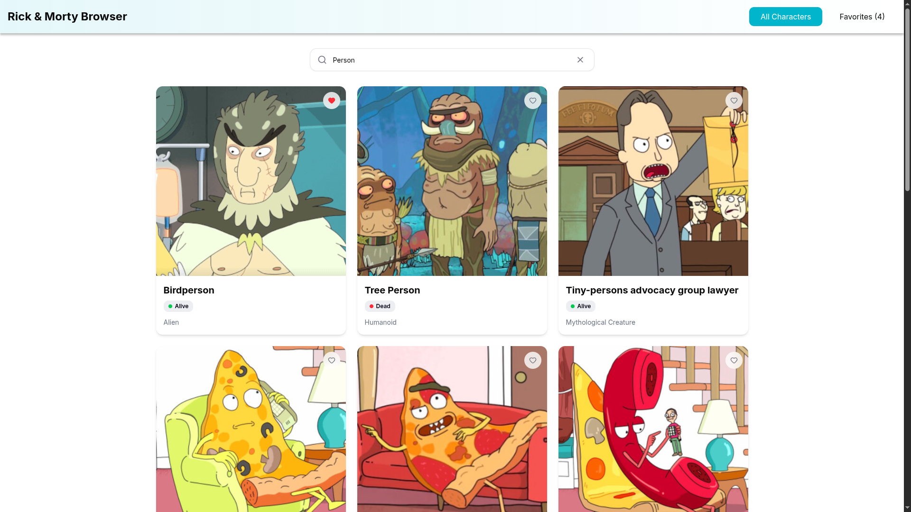
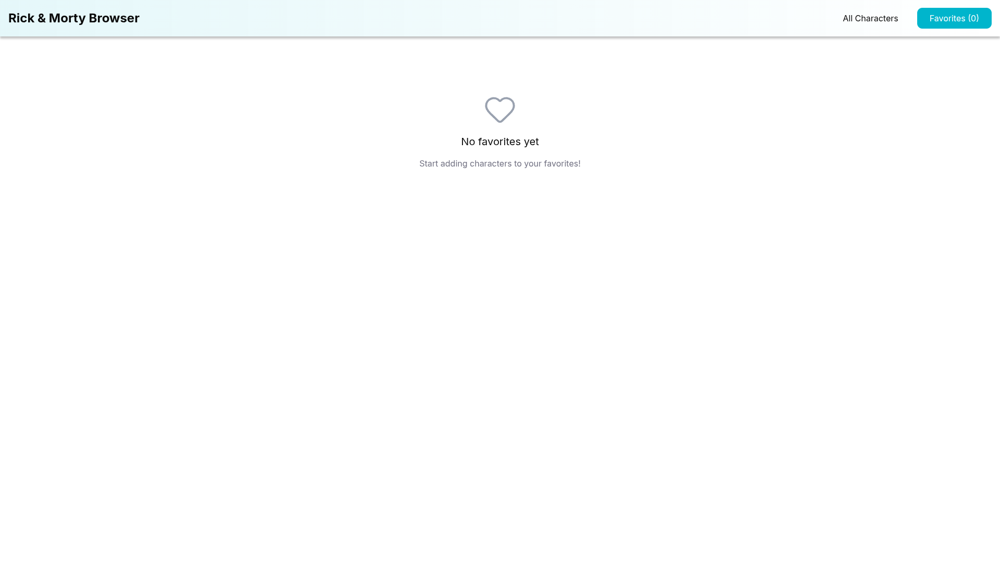
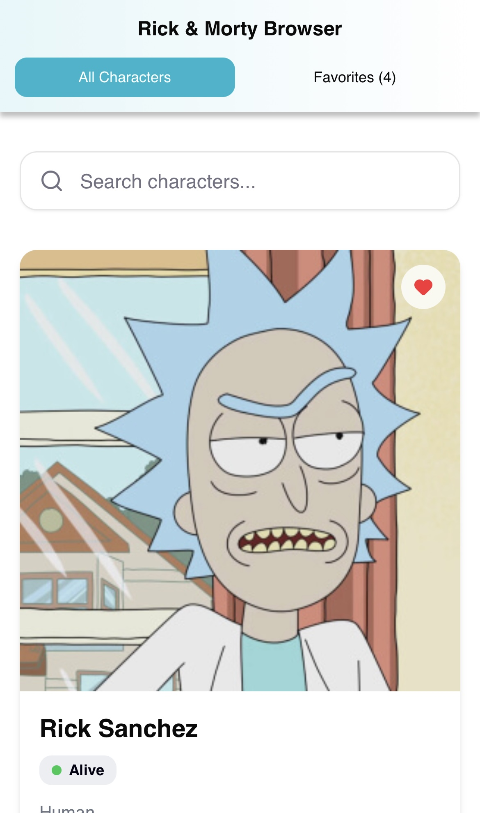
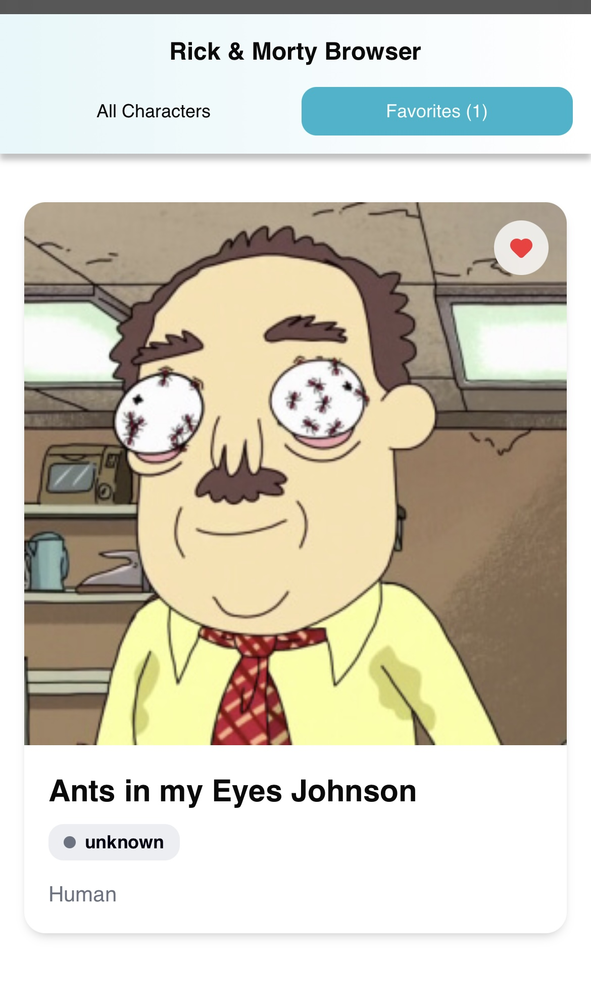
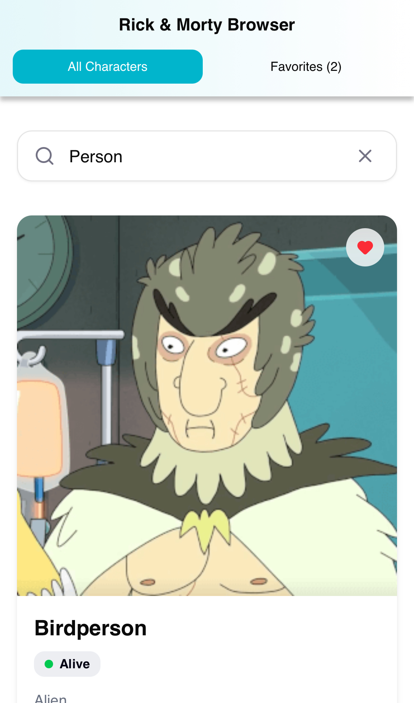
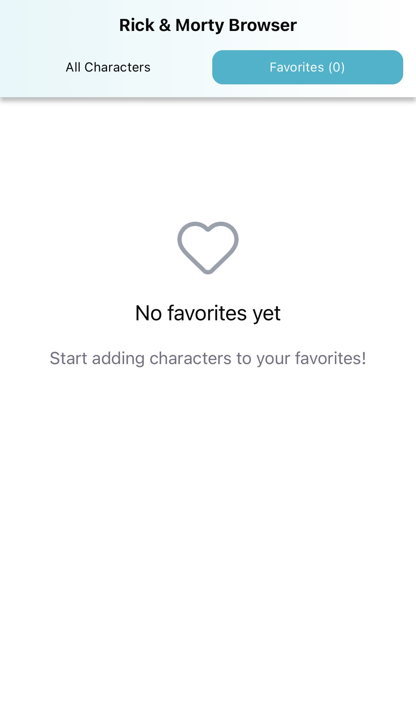
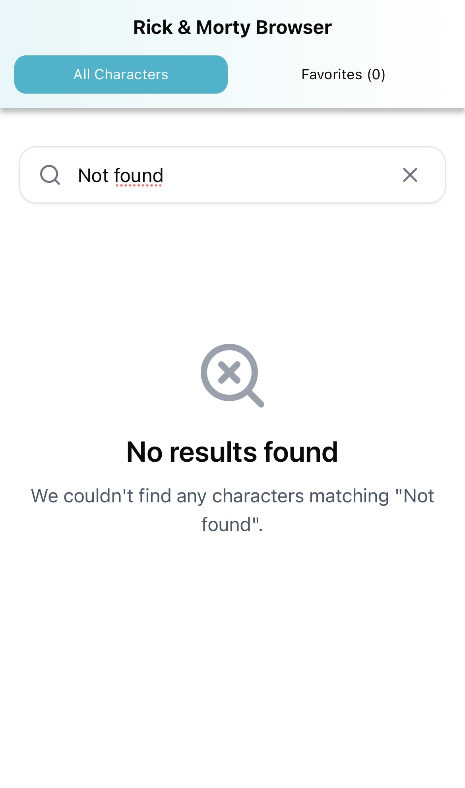

# 🚀 Rick and Morty Character Browser


Responsive web app for browsing Rick and Morty characters, featuring search, pagination, and a favorites system.
Developed with Vite, React, TailwindCSS using the **Rick and Morty GraphQL API:** `https://rickandmortyapi.com/graphql`.

> 🎵 It's time to get schwifty! 👽 🎵

## ✅ Core Features

- **Responsive Grid Layout** - Adapts from 1 column (mobile) to 3 columns (desktop)
- **Real-time Search** - Debounced search (300ms) and "no results" state
- **Smart Pagination** - Previous/Next navigation that maintains search queries
- **Favorites System** - Toggle favorites with localStorage persistence via Zustand
- **Favorites View** - Dedicated tab to browse favorited characters with counter
- **Loading Skeletons** - Smooth loading states for better UX
- **Status Badges** - Color-coded indicators for character status
- **Error Handling** - User-friendly error messages for API failures

## 🔗 Live Demo

**[🌐 https://rick-and-morty-browser.vercel.app/](https://rick-and-morty-browser.vercel.app/)**

## 🛠️ Tech Stack

| Technology | Version |
|-----------|---------|
| React | 19.1 |
| TypeScript | 5.8 |
| Vite | 7.1 |
| Tailwind CSS | 4.1 |
| shadcn/ui | v4 |
| Apollo Client | 3.14 |
| Zustand | 5.0 |


## 📦 Setup and Installation

To run this project locally:

1.  **Clone the repository:**
    ```bash
    git clone https://github.com/KimRuedasR/rick-and-morty-browser
    ```

2.  **Navigate to the project directory:**
    ```bash
    cd rick-and-morty-browser
    ```

3.  **Install dependencies:**
    ```bash
    npm install
    ```

4.  **Set up environment variables:**
    ```bash
    # Create .env file in root directory with:
    VITE_GRAPHQL_ENDPOINT=https://rickandmortyapi.com/graphql
    ```

5.  **Run the development server:**
    ```bash
    npm run dev
    # Or to expose on network:
    npm run host
    ```
    The application will be available at `http://localhost:5173`.

## 📝 Technology Decisions

### Views vs Pagination
A simple view toggle replaces complex routing for switching between all characters and favorites. This keeps the app lightweight while providing clear navigation between the two contexts.

### Environment Variable
The GraphQL endpoint is configured via environment variable following best practices, with the value loaded in `index.html` to ensure it's available before the app initializes.

### Performance Optimizations
- **Debounced Search** - Reduces API calls while typing
- **Code Splitting** - Vite's automatic bundling for faster loads
- **Optimized Images** - API provides pre-optimized character images
- **Loading Skeletons** - Immediate visual feedback during fetches

### Type Safety
Full TypeScript coverage across API responses, component props, and state management to catch errors early and improve developer experience.

## ⏱️ Time Spent

**Breakdown:**
- Initial setup and configuration: _30 minutes_
- UI components and layout: _30 minutes_
- GraphQL integration and data fetching: _1 hour_
- Searching and Pagination: _1 hour_
- Favorites system implementation: _1 hour_
- Final styling, responsive design and fixes: _1 hour_

_**Total Time:** Around 5 hours_

## 📊 Lighthouse Metrics

Performance metrics measured on production build:

| Metric | Result |
|:---|---:|
| **Performance** | _99_ 🟢 |
| **Accessibility** | _95_ 🟢 | 
| **Best Practices** | _100_ 🟢 |
| **SEO** | _100_ 🟢 |

_Reported score from the production build._
Image loading is dependent on the external API while the accessibility score is influenced by design constraints.

**Key Optimizations:**
- Lazy loading for improved initial load time
- Minimal JavaScript bundle size
- Accessible semantic HTML structure
- Responsive meta tags for mobile devices

## 📸 Screenshots

### Desktop Views
<p align="center">
  
  
  
  
  
</p>

### Mobile Views
<p align="center">
  
  
  
  
  
</p>

---
